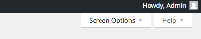

##Sådan får du Custom Fields frem i WordPress

+ Åben WordPress administratoren (ditsite.dk/wp-admin/)
+ Kør musen over **Posts / Blog Posts** (afhængig af din WordPress version),  og klik på  **Add New**

+ Når du er ankommet på **Add New Post** siden, skal du kigge opppe i højre hjørne og klikke på **Screen Options**.

+ Du vil nu få et panel frem, som viser de ting som du kan vise eller skjule på siden.
+ Vær sikker på at Custom Fields er aktiveret.

+ Klap dig selv på skulderen

---

> - Frederik Rabøl