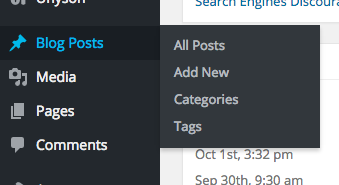
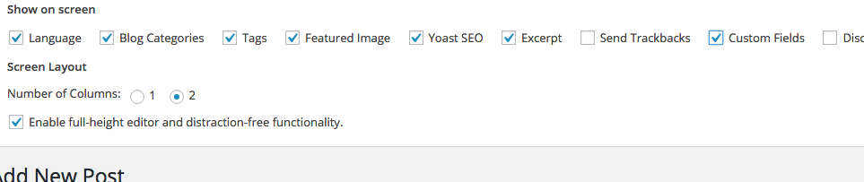

##How to show Custom Fields in WordPress

+ Open the WordPress Administrator (yoursite.com/wp-admin/)
+ Move your mouse over **Posts / Blog Posts** (Depending on your WordPress version),  and click  **Add New**.

+ When you arrive at the **Add New Post** page, take a look in the top right corner and click on **Screen Options**.

+ You will now see a panel, which controls which things are visible and hidden on the page.
+ Make sure Custom Fields are checked.

+ clap yourself on the shoulder.

---

> - Frederik Rabøl