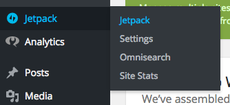
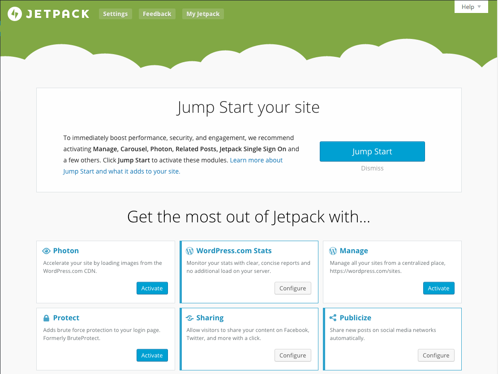

# How to Connect WordPress to the official WordPress App

## Requirements

1. WordPress.com login - [Register Here](https://wordpress.com/wp-login.php?register=true)
2. The JetPack plugin to be installed on your blog.
3. WordPress' App installed.

### What is Jetpack?
>JetPack is a plugin that connects WordPress.com to your WordPress site.

### See if Jetpack is installed
1. Find installed Plugins in the WordPress Administration. Plugins > Installed Plugins

2. Find Jetpack and click **"Activate"**

3. When the plugin is activated, you will recieve this message at the top of the page

4. click on **"Connect to WordPress.com"**

5. When you click that, you will be redirected to a page looking like this:

6. Enter your **WordPress.com credentials**

7. When the page is blank, or when you get a sucessful message on the page, return to your blog's WordPress administration (ex. myblog.com/wp-admin)

8. Find Jetpack in the menu and click on the Jetpack link

9. Jetpack's Dashboard looks like this

10. click **Activate** in the panel marked with **Manage**.
11. **Success!** Manage is now activated.

>What is "Manage", and what does it do?
>Manage gives you the option to manage your WordPress site or blog from WordPress.com/sites, but in this case, we want to manage it from the WordPress App.

---

###Connect WordPress via the WordPress App
1. Open the WordPress and on your Smartphone or Tablet
2. Login with your **WordPress.com** login.

###There you go the app should now work, good luck!
> -Frederik Rabøl

