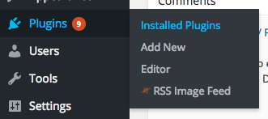
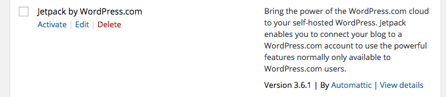
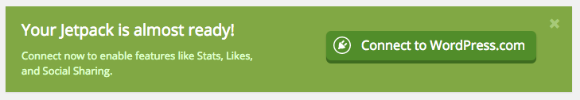
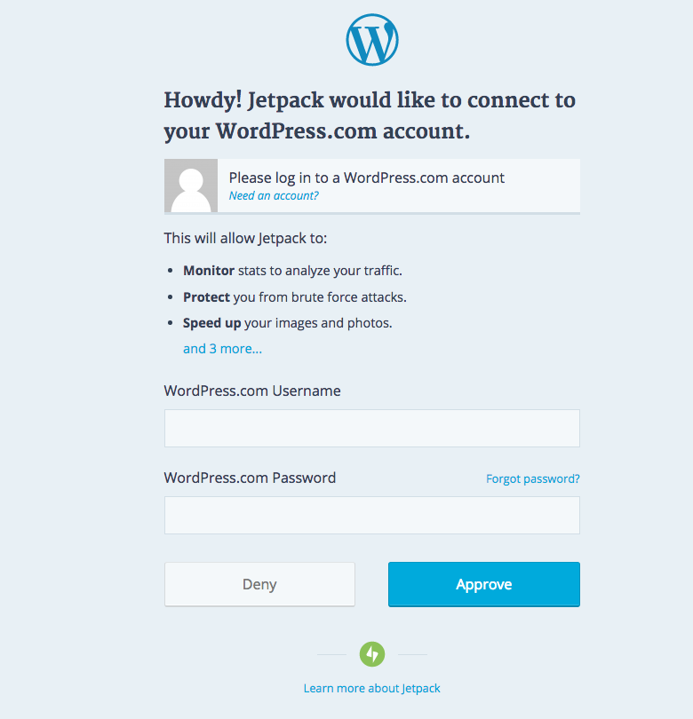
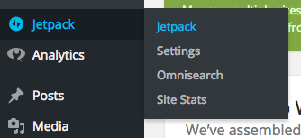
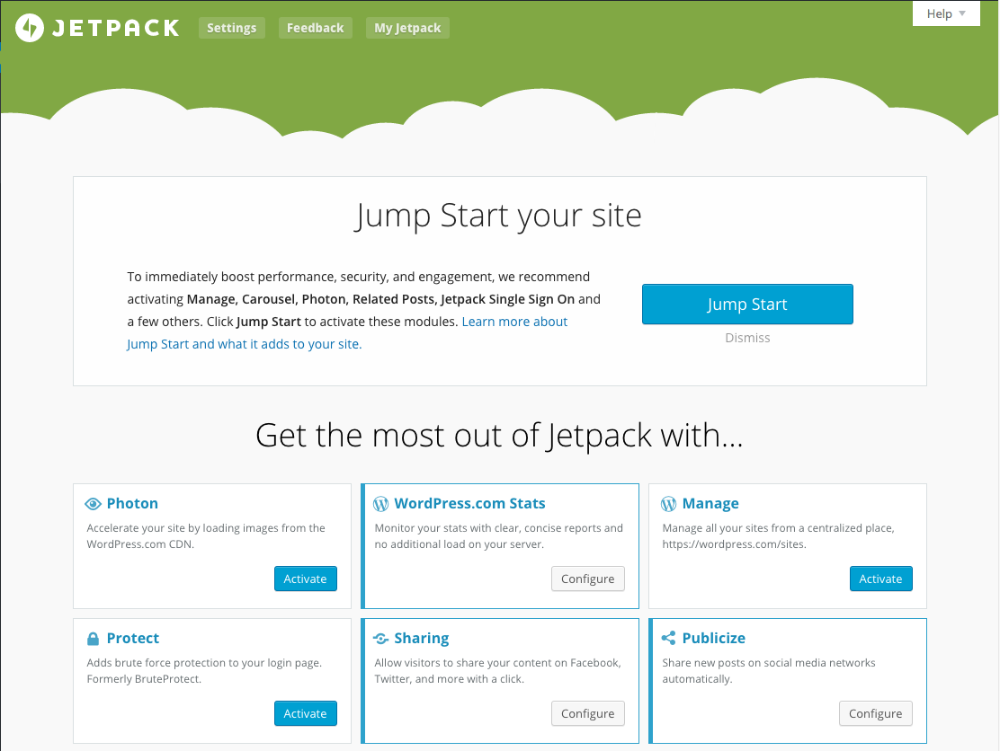
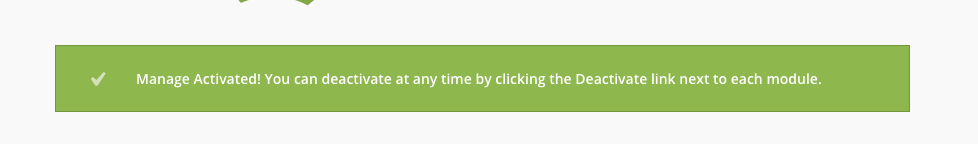

# Sådan kobler du WordPress' APP til dit WordPress site / Blog

## Krav

1. WordPress.com login - [Opret dig her](https://wordpress.com/wp-login.php?register=true)
2. JetPack plugin'et installeret på din Blog
3. WordPress' App installeret.

### Hvad er Jetpack?
>JetPack er et plugin der implementerer integration mellem dit WordPress site og WordPress.com

### Tjek om JetPack er installeret
1. Find installerede Plugins i WordPress Administrations Panelet. Plugins > Installed Plugins

2. Find Jetpack og klik **"Activate"**

3. Når pluginet er aktiveret vil du se denne besked i toppen af siden

4. klik på **"Connect to WordPress.com"**

5. Du vil derefter lande på denne side

6. Indtast dit **WordPress.com login**

7. Når siden er blevet blank, går du tilbage til din sides adminstrations panel (eksempel: minblog.dk/wp-admin)

8. Find Jetpack i menuen og klik på Jetpack linket

9. Jetpack forsiden ser sådan her ud.

10. Klik **Activate** på panelet der hedder **Manage**.
11. **Success!** Manage er nu aktiveret.
>Hvad gør Manage?
>Manage giver dig mulighed for at administrerer noget af dit site via WordPress.com/sites eller i vores tilfælde via WordPress' App.

12. Åben WordPress app'en på din smartphone / Tablet
13. Login med dit **WordPress.com** login.

#Så er du færdig, god fornøjelse!
> -Frederik Rabøl

