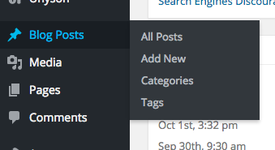
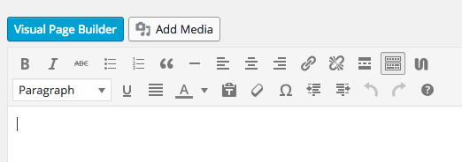
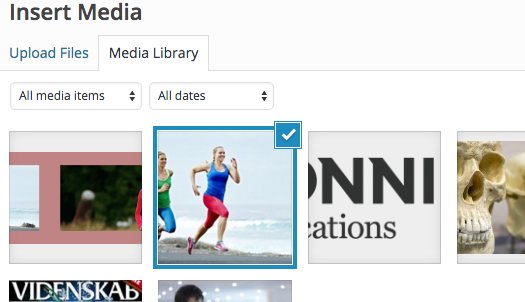
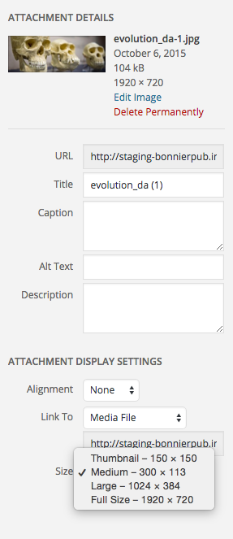
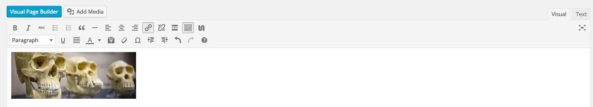
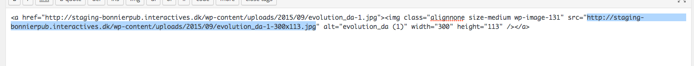
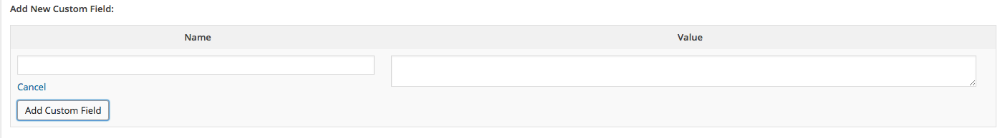
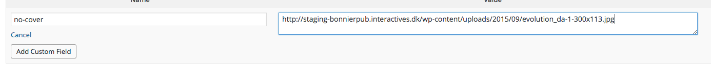
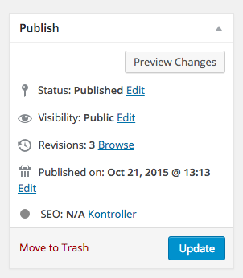
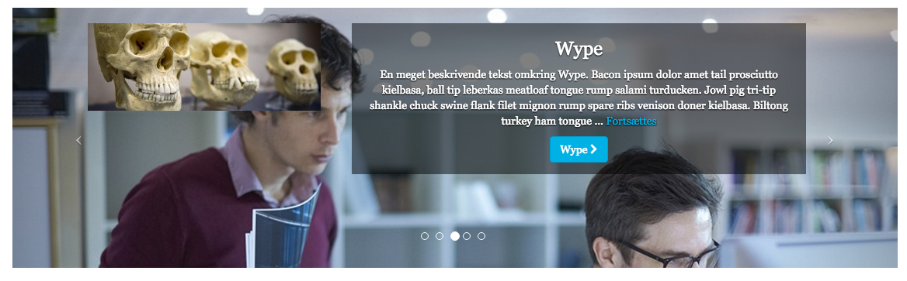

##Sådan tilføjer du et logo i stedet for et Magasin Cover på et Brand
Dette kan bruges hvis dit brand ikke har et Cover billede tildelt, eller har brug for et alternativt billede f.eks. Brandet's logo.

+ Åben WordPress administratoren (ditsite.dk/wp-admin/)
+ Kør musen over **Posts / Blog Posts** (afhængig af din WordPress version),  og klik på  **Add New**

+ Klik på **Add Media** knappen

+ Klik på det billede du gerne vil bruge.

+ I højre side vil du se "**Attachment Details**".

+ I feltet **Size** vælger du **Medium** størrelse, og klikker på **insert into post**.
+ Når du har indsat billedet i Posten, skal du gå over i Højre side, hvor du kan se **Visual | Text**. Klik på **Text**.

+ Nu vil du blive præsenteret af HTML kode. Vælg nu teksten fra "**src="**" og til **"**. Se evt. billedet herunder.
+ Kopier Teksten.

+ [Vær sikker på at du kan se Custom Fields](../../Show%20Custom%20Fields/da-vis-custom-fields.md).
+ Find **Add Custom Fields**
+ klik på **Enter new**

+ i Name skriver du "**no-cover**", og i **Value** skriver du stien/teksten til det billede du kopierede i Editoren.

+ rull op og klik på **Preview** knappen i øverste højre for at se dine ændringer, inden de kommer live.

+ Tjek at du har fået det ønskede resultat.

+ Hvis du har fået det ønskede resultat, klik på **Update** knappen.

+ Klap dig selv på skulderen

> -Frederik Rabøl 