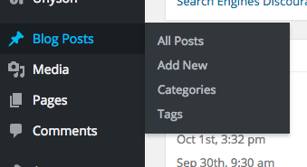
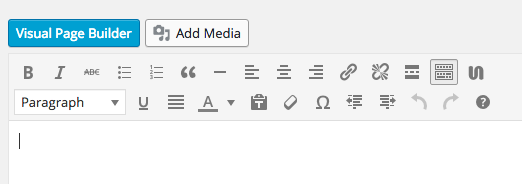
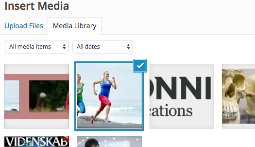
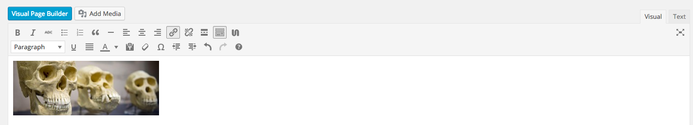
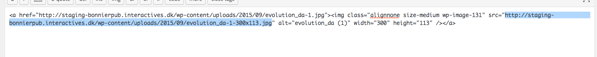
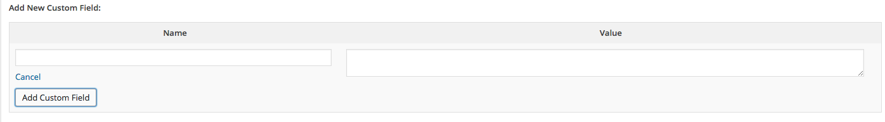

##How to add a logo instead of a Magazine Cover on a Brand
This can be useful, if your brand doesn't have a Magazine cover assigned, or needs an alternatve image, for example the Brand's logo.

+ Open the WordPress Administration (yoursite.com/wp-admin/)
+ Move your mouse over **Posts / Blog Posts** (depending on your WordPress version), and click on **Add New**.

+ Click the  **Add Media** button.

+ Select the image your would like to use.

+ On the right-hand side, you will see the "**Attachment Details**".

+ In the **Size** field, select **Medium** size, and click on **insert into post**.
+ When you have inserted the Image into your post, look to the right-hand side again. You will see some tabs called **Visual | Text**. click on the **Text** tab.

+ Now, you will be presented by raw HTML code. Now select the text between "**src="**" and **"**. take a look at the screenshot below if you're unsure what to do.
+ Copy the text.

+ [Make sure Custom Fields are visible](../../Show%20Custom%20Fields/en-show-custom-fields.md).
+ Find **Add Custom Fields**
+ Click on **Enter new**

+ in Name enter "**no-cover**", and in **Value** write the url/text to the image you copied earlier in the Editor.

+ scroll to the top, and click the **Preview** button to preview your changes.

+ Check the frontpage to make sure you have the Desired results.

+ If you see the desired results, click the **Update** button on the right side.

+ Pat yourself on the Shoulder.

> -Frederik Rabøl 