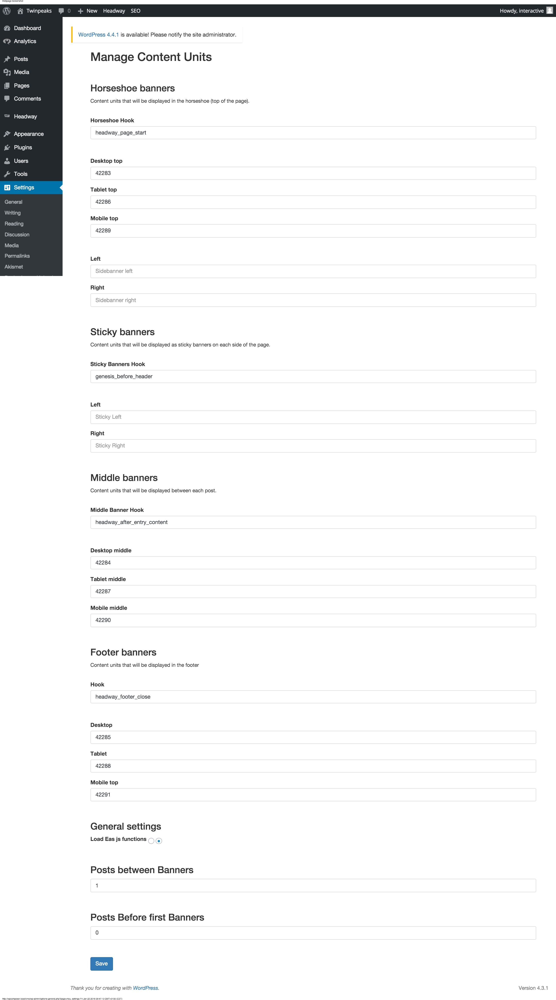

#Inserting Emediate banners using WP Manual Content Units

##1. Technical Requirements.

* You **NEED** 3 hooks, In your theme / template. The three hooks need to be placed in the following locations:

	1. before your header starts (above the header / logo)
	2. in the bottom of each post (for example in the bottom of each post in the list view. Or after a post in single view.)
	3. before the site footer

* If your theme already have hooks in these locations, just ignore the implementation guide below.

* To ensure that the banners will fit in the desired location, you need to make sure, that your container / wrapper is **minimum** the following sizes.

```
Desktop: 980px;

Tablet: 728px;

Mobile: 200px;
```

--

##2. Implementing the Hooks
You can name the three hooks whatever you want, but for the sake of K.I.S. (Keeping It Simple), just name them the following:

``
'header_banners',
'middle_banners',
'footer_banners'
``

When you have found the right locations for your banners, create a hook on that line.

``
<?do_action('hook_name') ?>
``

Example of implementation of the header banners, above the site header.

Example of header file:

````

<?do_action('header_name') ?>

<!-- THIS IS THE HEADER -->

<header>
	
</header>
````

1. Install the ``wp-manual-cu``plugin using the WordPress administrator
	(go to Plugins and click "Install Plugin".
2. Go the Plugin's settings page by going to Settings -> Manage Content Units	

##The Setting page


There are 4 fields per banner location.

#####Hook

- **What to enter**: the hook of banner that you defined in **Implementing the Hooks**. 

> Note: the **Sticky banners** & **Horshoe Banners** should use the ``header_banners`` hook.

#####Desktop, Tablet & Mobile

- **What to enter**: Emediate Content Unit ID. Usually a 5 digit number.
If you've recieved the following code.

````
<!-- "footer_bloggername_desktop" (section "example.com") -->
<div id="EAS_fif_42534"></div>
````

From the example above, the only thing you need is "**42534**".

--

#####General Settings

**Load EAS js functions**

-  can either be **true (left radio button)**, or **false(default) (right as shown on the screenshot)**.

-  If the site you're working on does **NOT**, have WhiteAlbum external shell (eg. if the site you're working on has Costume.no, Bo-Bedre.no, etc. branding), this should be **OFF (right)**.

-  If the site does not have branding, or blog is displaying Stylista.no branding this should be **ON (left)**.

**Posts Between Banners**

- Amount of posts, before a new banner (middle banner) is shown. Default is 0 which means it'll display banners for each post.

**Posts Before first Banners**

- This is not required, but can be useful. If you want to skip some posts before displaying a banner, this should be filled out. This has to be **the amount of posts you want to skip +1**.

Let's saying you want to insert a banner after one post. Write **2**.

````
[POST]
<!-- this is where I want a banner -->
[POST]
[POST]
[POST]
````

But if you want to insert the banner after two posts, you write **3**.

````
[POST]
[POST]
<!-- this is where I want a banner -->
[POST]
[POST]
````